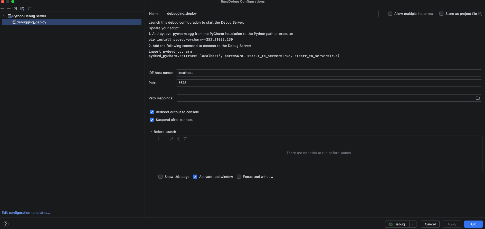

## Prerequisites

- PyCharm Professional (the "Python Debug Server" feature is not available in Community Edition)
- `pydevd-pycharm` installed in your bundle's venv 

---

## Step 1: Create a PyCharm Debug Server and install 

1. Go to **Run → Edit Configurations…**
2. Click **+** → select **Python Debug Server**
3. Configure:
   - **Name:** `<configuration_name>`
   - **Host:** `localhost`
   - **Port:** `5678`
1. Click **OK**



Install `pydevd-pycharm` with a version matching your PyCharm build:

```bash
uv pip install pydevd-pycharm~=<pycharm_version_from_your_run_config>
```
## Step 2: Add the Debug Hook to Your Code

Insert the following in the file you want to debug. For mutator/resource debugging, the best place is the bundle's resource entry point (e.g. `resources/__init__.py`):

```python
import os

if os.getenv("BUNDLE_DEBUG"):
    import pydevd_pycharm
    pydevd_pycharm.settrace(
        'localhost',
        port=5678,
        stdout_to_server=False,
        stderr_to_server=True,
        suspend=True,
    )


```

> ⚠️ **`stdout_to_server` must be `False`.** The Databricks CLI communicates with the Python subprocess over stdout using a JSON protocol. Redirecting stdout to the debug server will break the deploy.

You can also place the hook inside a specific mutator function if you only want to break there.

Here the BUNDLE_DEBUG environment variable is used to conditionally enable the debug hook. This way, you can leave the code in place and only set the variable when you want to debug.
For example in the makefile:
```makefile
debug-validate:
	@echo "Verifying bundle (DEBUG)... $$BUNDLE"
	cd ./bundles/$(BUNDLE) && BUNDLE_DEBUG=1 databricks bundle validate -t $(DATABRICKS_ENV) -p $(PROFILE)
```

## Step 3: Set Breakpoints

Set breakpoints in any of the Python files that run during deploy — mutators, resource loaders, etc.

## Step 4: Start the Debug Server

In PyCharm, select the **Bundle Debug Server** run configuration and click the **Debug ▶** button. You should see:

```
Starting debug server at port 5,678
Waiting for process connection…
```

Leave this running.

## Step 5: Run Bundle Validate or Deploy

In a terminal, trigger the bundle command. Use `validate` or `deploy`:

```bash
# Via Makefile
make validate BUNDLE=running_hours_gold ENV=dev

# Or directly
cd bundles/running_hours_gold
databricks bundle validate -t dev -p fm-databricks-dev
```

When the Python subprocess reaches the `settrace()` call, it connects to PyCharm and execution pauses. PyCharm will switch to the debugger view.